# Business Requirements Document (BRD)
## School Management System — Web Application

---

| Field              | Details                          |
|--------------------|----------------------------------|
| **Document Title** | School Management System BRD     |
| **Version**        | 1.1                              |
| **Status**         | Draft                            |
| **Prepared By**    | Senior Business Analyst          |
| **Date**           | May 2, 2026                      |
| **Change**         | v1.1 — Added Admin-Provisioned Credential System (Section 7) |

---

## Table of Contents

1. [Executive Summary](#1-executive-summary)
2. [Project Scope](#2-project-scope)
3. [Stakeholders & User Roles](#3-stakeholders--user-roles)
4. [System Architecture Overview](#4-system-architecture-overview)
5. [Functional Requirements](#5-functional-requirements)
   - 5.1 [User Roles & Permissions](#51-user-roles--permissions)
   - 5.2 [Academic Structure](#52-academic-structure)
   - 5.3 [Student Management](#53-student-management)
   - 5.4 [Teacher Management](#54-teacher-management)
   - 5.5 [Routine (Class Schedule) Management](#55-routine-class-schedule-management)
   - 5.6 [Attendance Management](#56-attendance-management)
   - 5.7 [Examination & Result Management](#57-examination--result-management)
   - 5.8 [Fee Management](#58-fee-management)
   - 5.9 [Notice & Communication](#59-notice--communication)
   - 5.10 [Dashboard & Reports](#510-dashboard--reports)
6. [Non-Functional Requirements](#6-non-functional-requirements)
7. [Authentication & Security](#7-authentication--security)
8. [System Requirements](#8-system-requirements)
9. [Data Flow & Process Diagrams](#9-data-flow--process-diagrams)
10. [Assumptions & Constraints](#10-assumptions--constraints)
11. [Glossary](#11-glossary)

---

## 1. Executive Summary

The School Management System (SMS) is a comprehensive, web-based application designed to digitize and streamline the end-to-end administrative and academic operations of a school. The system replaces manual, paper-based processes with a unified digital platform accessible to Admins, Teachers, Students, and Parents through a secure, role-based interface.

The application will manage academic structures, student lifecycles, teacher assignments, class schedules, attendance, examinations, fee collection, and institutional communications — all within a single, centralized system.

---

## 2. Project Scope

### In Scope

- Role-based access control with four distinct user roles
- Academic structure configuration (classes, sections, subjects)
- Complete student lifecycle management (admission → promotion → graduation/dropout)
- Teacher profile and workload management
- Class routine (timetable) creation and management
- Daily attendance tracking for students and teachers
- Examination setup, marks entry, and result/report card generation
- Fee structure definition, payment recording, and due tracking
- Institutional notice board and targeted communications
- Administrative dashboard with key performance metrics and downloadable reports

### Out of Scope

- Third-party payment gateway integration (Phase 1)
- Library management module
- Transport management module
- Payroll/HR management for staff

---

## 3. Stakeholders & User Roles

| Stakeholder | Role in System    | Primary Interest                             |
|-------------|-------------------|----------------------------------------------|
| School Admin | System Admin     | Full operational control, reporting           |
| Teacher      | Teacher          | Attendance, marks, schedule management        |
| Student      | Student          | View routine, results, notices                |
| Parent       | Parent           | Monitor child's attendance, fees, results     |
| IT Team      | System Operator  | Infrastructure, security, data integrity      |

---

## 4. System Architecture Overview

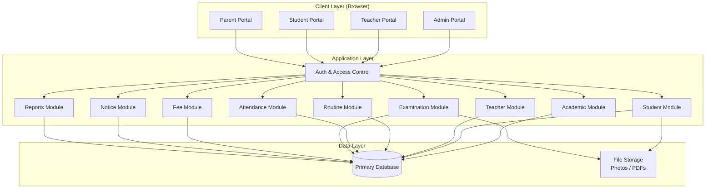

---

## 5. Functional Requirements

---

### 5.1 User Roles & Permissions

The system enforces strict role-based access control (RBAC). Each user role has a defined, non-overlapping set of permissions.

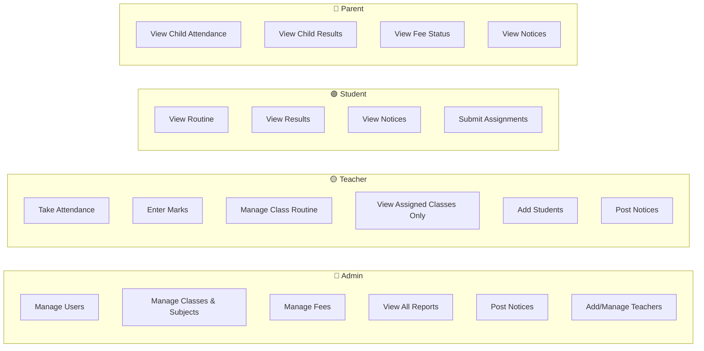

#### Permission Matrix

| Feature                     | Admin | Teacher | Student | Parent |
|-----------------------------|:-----:|:-------:|:-------:|:------:|
| Manage Users                | ✅    | ❌      | ❌      | ❌     |
| Manage Classes/Subjects     | ✅    | ❌      | ❌      | ❌     |
| Add Teachers                | ✅    | ❌      | ❌      | ❌     |
| Add Students                | ✅    | ✅      | ❌      | ❌     |
| Take Student Attendance     | ✅    | ✅      | ❌      | ❌     |
| Enter Exam Marks            | ✅    | ✅      | ❌      | ❌     |
| Manage Fee Structure        | ✅    | ❌      | ❌      | ❌     |
| Post Notices                | ✅    | ✅      | ❌      | ❌     |
| View Own Routine            | ✅    | ✅      | ✅      | ❌     |
| View Child's Records        | ❌    | ❌      | ❌      | ✅     |
| Submit Assignment           | ❌    | ❌      | ✅      | ❌     |
| View Reports                | ✅    | ❌      | ❌      | ❌     |

---

### 5.2 Academic Structure

#### 5.2.1 Class & Section Management

**Business Rules:**
- An Admin can create academic classes (e.g., Grade 1, Grade 10).
- Each class can have one or more sections (e.g., A, B, C).
- Each class-section combination must have exactly one assigned Class Teacher.
- Class and section names must be unique within the school.

**Required Fields:**

| Field             | Type    | Mandatory |
|-------------------|---------|-----------|
| Class Name        | Text    | ✅         |
| Section Name      | Text    | ✅         |
| Class Teacher     | Lookup  | ✅         |
| Academic Year     | Year    | ✅         |

#### 5.2.2 Subject / Course Management

**Business Rules:**
- Each subject must have a unique code within a class.
- A subject can be assigned to multiple classes.
- A subject teacher can only be assigned to classes they are linked to.
- The marks structure defines the evaluation weightage for that subject.

**Required Fields:**

| Field              | Type       | Mandatory |
|--------------------|------------|-----------|
| Subject Name       | Text       | ✅         |
| Subject Code       | Text       | ✅         |
| Assigned Class     | Lookup     | ✅         |
| Subject Teacher    | Lookup     | ✅         |
| Quiz Marks         | Number     | ✅         |
| Assignment Marks   | Number     | ✅         |
| Final Exam Marks   | Number     | ✅         |
| Total Marks        | Calculated | Auto       |

```mermaid
erDiagram
    CLASS ||--o{ SECTION : "has"
    CLASS ||--o{ SUBJECT : "offers"
    SECTION ||--|| TEACHER : "has class teacher"
    SUBJECT ||--|| TEACHER : "assigned to"
    SUBJECT {
        string name
        string code
        int quiz_marks
        int assignment_marks
        int final_marks
    }
    CLASS {
        string name
        string academic_year
    }
    SECTION {
        string name
    }
```

---

### 5.3 Student Management

#### 5.3.1 Admission

**Business Rules:**
- Student ID is auto-generated by the system upon successful admission.
- Photo upload is mandatory (JPEG/PNG, max 2MB).
- At least one guardian record must be created per student.
- Date of Birth must be validated (student must be within school-acceptable age range).

**Required Fields:**

| Field            | Type       | Mandatory |
|------------------|------------|-----------|
| Full Name        | Text       | ✅         |
| Date of Birth    | Date       | ✅         |
| Gender           | Enum       | ✅         |
| Photo            | File       | ✅         |
| Guardian Name    | Text       | ✅         |
| Guardian Contact | Phone      | ✅         |
| Guardian Email   | Email      | Optional  |
| Guardian Relation| Enum       | ✅         |
| Student ID       | Auto-gen   | Auto       |

#### 5.3.2 Academic Assignment

**Business Rules:**
- A student must be assigned to exactly one class and one section.
- Roll numbers must be unique within a class-section.
- Students can submit assignments through the portal against a defined assignment task.

#### 5.3.3 Student Lifecycle

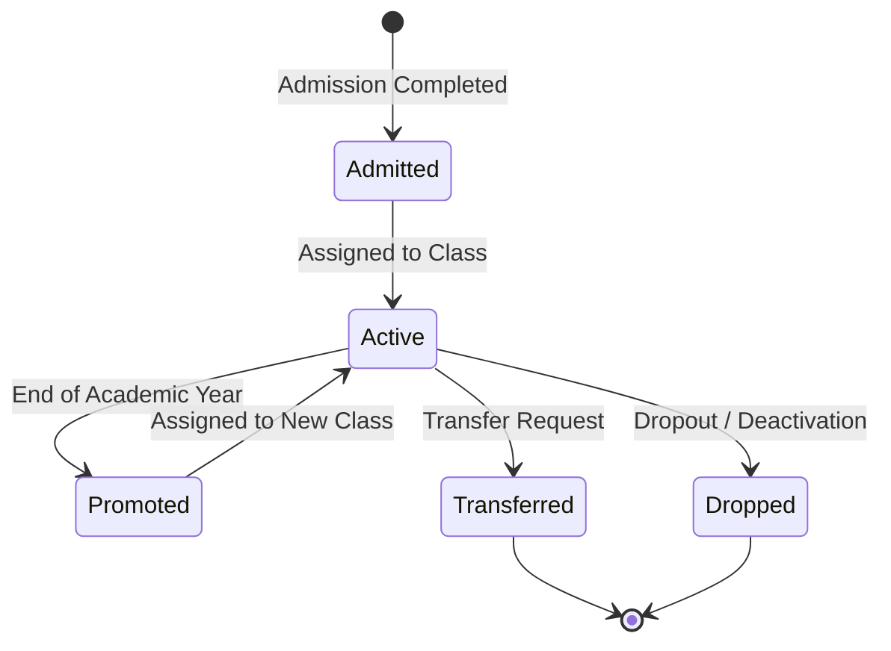

**Business Rules:**
- Promotion moves a student to the next class at the end of the academic year. Previous records are preserved.
- A transferred student's complete academic history is maintained in the system.
- Dropped/deactivated students cannot log in but their records are retained for audit.

#### 5.3.4 Student Records

- Full student profile with photo
- Academic history (all previous class records, marks, attendance)
- Fee payment history
- Assignment submission history

---

### 5.4 Teacher Management

#### 5.4.1 Teacher Profile

**Required Fields:**

| Field                  | Type   | Mandatory |
|------------------------|--------|-----------|
| Full Name              | Text   | ✅         |
| Contact Number         | Phone  | ✅         |
| Email Address          | Email  | ✅         |
| Subject Specialization | Lookup | ✅         |
| Joining Date           | Date   | ✅         |
| Photo                  | File   | Optional  |

#### 5.4.2 Teacher Assignment

**Business Rules:**
- A teacher can be assigned to multiple classes, sections, and subjects.
- A teacher's schedule is auto-generated from their subject assignments and the class routine.
- A teacher can only manage attendance and marks for their assigned classes/subjects.

#### 5.4.3 Work Tracking

- View personal teaching schedule (weekly routine view)
- Attendance record for the teacher themselves (recorded by Admin)

---

### 5.5 Routine (Class Schedule) Management

**Business Rules:**
- Routine is defined on a weekly basis (Monday–Friday or school-defined days).
- Each time slot in the routine must have exactly one Subject, one Teacher, and one Time Range.
- The system generates two views from the same routine dataset:
  - **Student Routine View:** Shows schedule for their class-section.
  - **Teacher Routine View:** Shows their personal teaching schedule across all classes.
- Conflicts (same teacher double-booked in a time slot) must be validated and rejected.

**Data Model:**

| Field       | Type    | Mandatory |
|-------------|---------|-----------|
| Class       | Lookup  | ✅         |
| Section     | Lookup  | ✅         |
| Day         | Enum    | ✅         |
| Time From   | Time    | ✅         |
| Time To     | Time    | ✅         |
| Subject     | Lookup  | ✅         |
| Teacher     | Lookup  | ✅         |

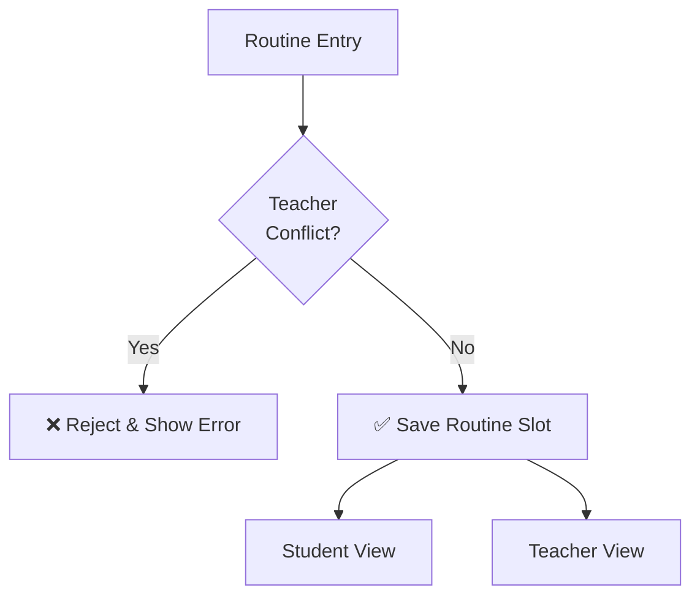

---

### 5.6 Attendance Management

#### 5.6.1 Student Attendance

**Business Rules:**
- Attendance is taken once per day, per class-section.
- Status options: `Present`, `Absent`, `Late`.
- Only the assigned class teacher or subject teacher can take attendance for their class.
- Attendance cannot be taken for future dates.
- Past attendance can be edited by Admin only.

#### 5.6.2 Teacher Attendance

- Admin records teacher attendance daily.
- Status options: `Present`, `Absent`, `On Leave`.

#### 5.6.3 Attendance Reports

- **Monthly Attendance Report:** Class-wise attendance matrix for the month.
- **Student-Wise Attendance Percentage:** Calculates percentage of days present.
- **Low Attendance Alert:** Flag students below a configurable threshold (e.g., <75%).

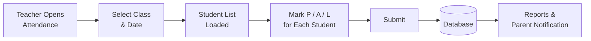

---

### 5.7 Examination & Result Management

#### 5.7.1 Exam Setup

**Business Rules:**
- Admin creates exam events (e.g., Midterm, Final Exam).
- An exam is linked to a specific class and a specific academic year.
- Subjects to be examined are defined per exam event.

#### 5.7.2 Marks Entry

**Business Rules:**
- Only the assigned subject teacher can enter marks for their subject.
- Marks are entered per component: Quiz, Assignment, Written Exam.
- Marks cannot exceed the maximum defined in the subject's marks structure.
- Marks submission is locked after the Admin closes the exam entry window.

#### 5.7.3 Result Calculation

The system automatically computes results using the following logic:

```
Total Marks     = Quiz Marks + Assignment Marks + Written Exam Marks
Percentage      = (Total Obtained / Total Maximum) × 100
Grade / GPA     = Derived from configurable grading scale
Pass / Fail     = Based on minimum passing percentage per subject
```

**Grading Scale (Configurable by Admin):**

| Percentage    | Grade | GPA |
|---------------|-------|-----|
| 90 – 100      | A+    | 4.0 |
| 80 – 89       | A     | 3.7 |
| 70 – 79       | B     | 3.0 |
| 60 – 69       | C     | 2.0 |
| 50 – 59       | D     | 1.0 |
| Below 50      | F     | 0.0 |

#### 5.7.4 Report Card

- Auto-generated per student, per exam.
- Displays: student info, all subjects, marks breakdown, total, grade, GPA, pass/fail status.
- Includes teacher remarks (free-text field per subject teacher).
- Downloadable and printable as **PDF**.

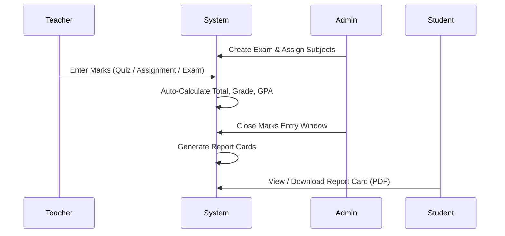

---

### 5.8 Fee Management

#### 5.8.1 Fee Structure

**Business Rules:**
- Admin defines fee types applicable to each class (e.g., Tuition Fee, Exam Fee, Others).
- Fee amounts can be set per class and per academic year.
- Fee structure must be defined before any payments can be recorded.

**Fee Types:**

| Type       | Description                             |
|------------|-----------------------------------------|
| Tuition    | Monthly or term-based tuition charges   |
| Exam Fee   | Per-exam or per-term examination fee    |
| Others     | Transport, library, lab, activity fees  |

#### 5.8.2 Payment Tracking

**Business Rules:**
- Payments are recorded manually by Admin.
- Each payment record must include: student, fee type, amount paid, payment date, and receipt number.
- The system calculates outstanding dues automatically.
- Partial payments are supported.

#### 5.8.3 Fee Reports

- **Student Payment History:** All transactions for a student with dates and amounts.
- **Outstanding Dues List:** List of students with pending fees, filterable by class.
- **Fee Collection Summary:** Total collected vs. total expected per class per month.

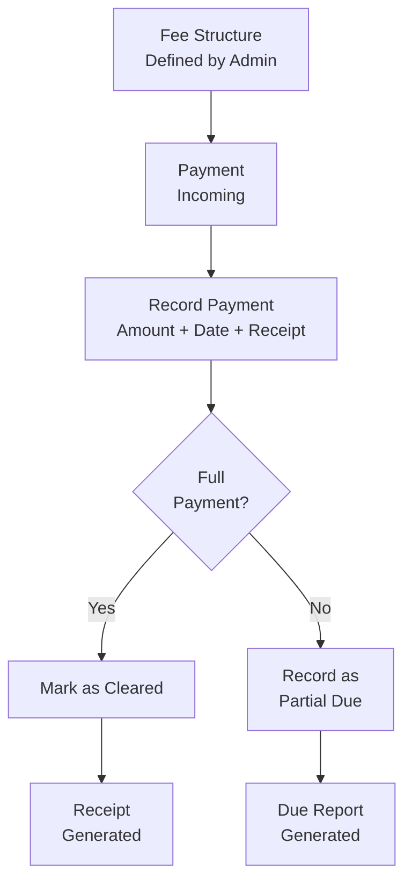

---

### 5.9 Notice & Communication

**Business Rules:**
- Admin and Teachers can create and publish notices.
- Each notice must have a target audience:
  - `All` — Visible to everyone.
  - `Specific Class` — Visible only to that class's students, teachers, and parents.
- Notices appear as dashboard notifications immediately upon publishing.
- Notices have an optional expiry date after which they are auto-archived.

**Required Fields:**

| Field           | Type    | Mandatory |
|-----------------|---------|-----------|
| Title           | Text    | ✅         |
| Body            | Rich Text | ✅       |
| Target Audience | Enum    | ✅         |
| Target Class    | Lookup  | Conditional |
| Expiry Date     | Date    | Optional  |
| Posted By       | Auto    | Auto       |
| Posted At       | Auto    | Auto       |

---

### 5.10 Dashboard & Reports

#### 5.10.1 Admin Dashboard

The Admin dashboard provides a real-time overview of the institution's operational status.

| Widget                   | Description                                        |
|--------------------------|----------------------------------------------------|
| Total Students           | Count of active enrolled students                  |
| Total Teachers           | Count of active teachers                           |
| Today's Attendance       | % of students present today (school-wide)          |
| Fee Collection Summary   | Month-to-date collected vs. expected               |
| Recent Notices           | Last 5 published notices                           |
| Upcoming Exams           | Next scheduled examination events                  |

#### 5.10.2 Downloadable Reports

| Report               | Format  | Filter Options                          |
|----------------------|---------|-----------------------------------------|
| Attendance Report    | PDF/CSV | Class, Section, Date Range              |
| Result Report        | PDF     | Class, Section, Exam                    |
| Financial Report     | PDF/CSV | Month, Class, Fee Type                  |
| Student List         | PDF/CSV | Class, Section, Status                  |
| Teacher Schedule     | PDF     | Teacher, Week                           |

---

## 6. Non-Functional Requirements

| Category        | Requirement                                                                         |
|-----------------|-------------------------------------------------------------------------------------|
| Performance     | Page load time ≤ 2 seconds under normal load (up to 500 concurrent users)          |
| Availability    | 99.5% uptime during school hours (7 AM – 6 PM on school days)                     |
| Usability       | Intuitive UI, no technical training required for standard operations                |
| Scalability     | System must support up to 5,000 student records without performance degradation     |
| Accessibility   | Compatible with modern browsers (Chrome, Firefox, Edge, Safari)                    |
| Responsiveness  | UI must be responsive for tablet and desktop screen sizes                           |
| Maintainability | Modular codebase with documented APIs for future feature extension                  |

---

## 7. Authentication & Security

### 7.1 Account Provisioning Model

> **Core Principle:** No user can self-register. Every user account in the system — regardless of role — is created exclusively by the **Admin**. The Admin assigns the username and initial password and hands them to the user directly.

This applies to all four roles:

| Role    | Account Created By | Credentials Handed To     |
|---------|--------------------|---------------------------|
| Admin   | System (initial setup) | School IT Administrator |
| Teacher | Admin              | Teacher directly          |
| Student | Admin              | Student directly          |
| Parent  | Admin              | Parent directly           |

---

### 7.2 Admin: Creating User Accounts

When the Admin adds a new Teacher, Student, or Parent to the system, the account creation form requires:

**Account Creation Fields:**

| Field             | Type       | Rule                                              |
|-------------------|------------|---------------------------------------------------|
| Full Name         | Text       | Auto-populated from profile                       |
| Username          | Text       | Must be unique across all users; no spaces        |
| Initial Password  | Text       | Admin-defined; must meet password policy          |
| Role              | Enum       | Admin / Teacher / Student / Parent                |
| Linked Profile    | Lookup     | Linked to Teacher / Student / Parent profile record |
| Account Status    | Enum       | Active / Inactive (default: Active)               |

**Username Format Rules (Recommended Convention):**

| Role    | Format Example         | Example          |
|---------|------------------------|------------------|
| Teacher | `t.firstname.lastname` | `t.john.smith`   |
| Student | `s.studentID`          | `s.20240101`     |
| Parent  | `p.studentID`          | `p.20240101`     |
| Admin   | `admin` or custom      | `admin`          |

> The Admin may define a school-wide username convention. The system enforces uniqueness but does not mandate a specific format.

---

### 7.3 Account Provisioning Workflow

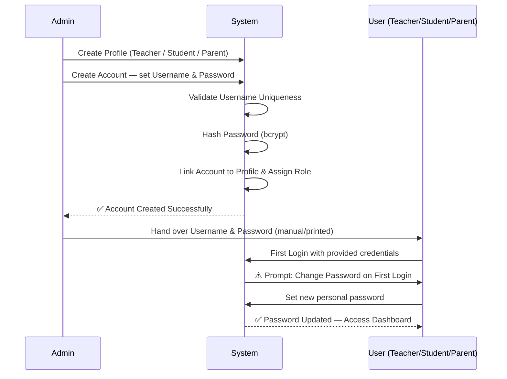

---

### 7.4 First-Time Login & Forced Password Change

**Business Rules:**
- On the very first login with Admin-provided credentials, the system **must** prompt the user to set a new personal password.
- The user **cannot** access any other part of the system until the password is changed.
- The new password must differ from the Admin-provided initial password.
- This ensures the Admin no longer knows the user's active password after first login.

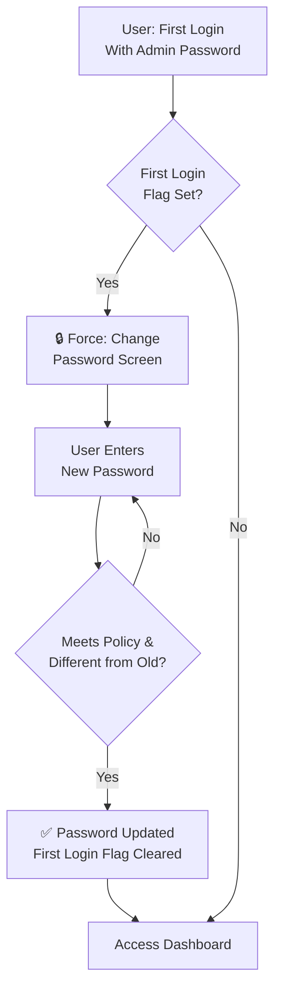

---

### 7.5 Login Flow (All Users)

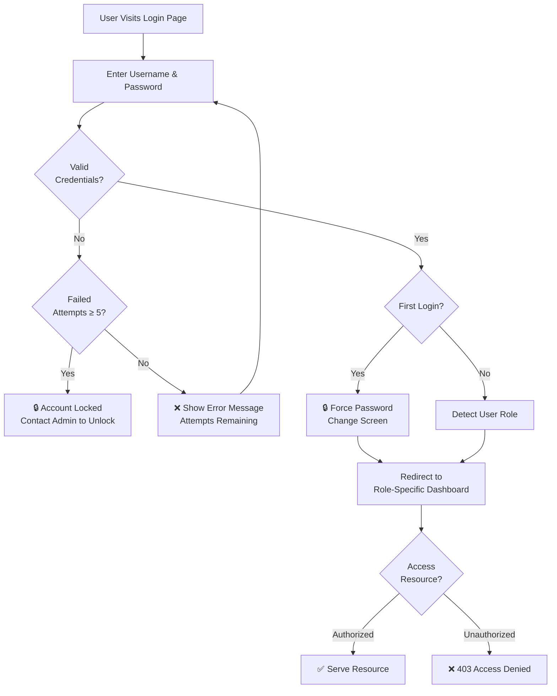

---

### 7.6 Password Management

#### 7.6.1 Password Policy

| Rule                          | Specification                                      |
|-------------------------------|----------------------------------------------------|
| Minimum Length                | 8 characters                                       |
| Character Requirements        | At least one letter and one number                 |
| Storage                       | Hashed using bcrypt (never stored as plain text)   |
| Reuse                         | Cannot reuse the last 3 passwords                  |
| Admin-Set vs User-Set         | Admin sets initial password only; user owns it after first login |

#### 7.6.2 Admin: Reset a User's Password

If a user forgets their password, they **must contact the Admin**. There is no self-service password reset via email in Phase 1.

**Admin Password Reset Flow:**

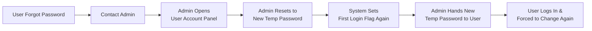

**Business Rules:**
- Admin can reset any user's password at any time from the User Management panel.
- After a reset, the First Login flag is reactivated — the user must change their password on next login.
- The Admin cannot view any user's active (hashed) password, only reset it.

---

### 7.7 Account Management by Admin

The Admin has full control over all user accounts through a dedicated **User Management** panel.

**Admin Capabilities:**

| Action                 | Description                                              |
|------------------------|----------------------------------------------------------|
| Create Account         | Add new user with username, password, and role           |
| Edit Account           | Change username or linked profile                        |
| Reset Password         | Set a new temp password; triggers forced change on login |
| Activate Account       | Re-enable a previously deactivated account               |
| Deactivate Account     | Prevent login without deleting data (e.g., left teacher) |
| Unlock Account         | Unlock accounts locked due to failed login attempts      |
| View All Users         | List all system accounts with role and status            |

**Business Rules:**
- An Admin cannot delete their own account.
- At least one Admin account must exist in the system at all times.
- Deactivated users cannot log in but their historical data (attendance, marks, records) is preserved.
- A Parent account is linked to a specific Student profile; one parent account can be linked to multiple children (siblings).

---

### 7.8 Role-to-Profile Linking

Each user account is linked to exactly one profile record in the system:

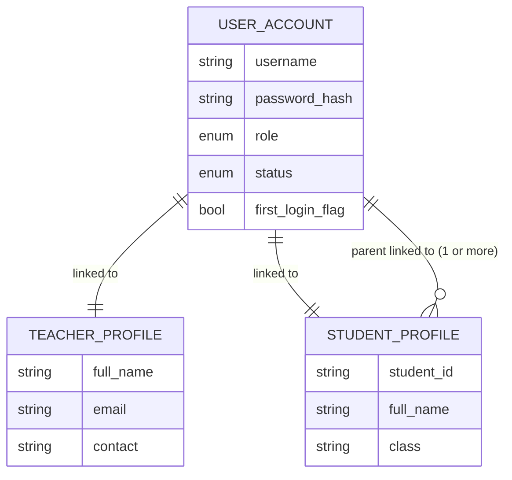

---

### 7.9 Security Requirements

| Requirement         | Specification                                                         |
|---------------------|-----------------------------------------------------------------------|
| No Self-Registration| All accounts created exclusively by Admin                            |
| Password Hashing    | bcrypt hashing; plain-text passwords never stored                    |
| Forced First Change | User must change Admin-provided password on first login              |
| Session Management  | Auto-logout after 30 minutes of inactivity                           |
| Account Lockout     | Locked after 5 consecutive failed login attempts; Admin unlocks      |
| Access Control      | All routes and API endpoints protected by role-based middleware       |
| Data Isolation      | Each role accesses only their permitted data scope                   |
| HTTPS / TLS-SSL     | All data transmission encrypted                                       |
| Audit Logging       | All account actions (create, reset, lock, deactivate) logged with timestamp and Admin ID |

---

## 8. System Requirements

| Category         | Specification                                                          |
|------------------|------------------------------------------------------------------------|
| Platform         | Web-based application, accessible via standard browser                 |
| Frontend         | Responsive, clean UI with role-based dashboards                        |
| Backend          | RESTful API architecture                                               |
| Database         | Relational database (e.g., PostgreSQL / MySQL)                         |
| File Storage     | Server-side storage for photos and generated PDF documents             |
| PDF Generation   | Server-side PDF rendering for report cards and financial reports       |
| Browser Support  | Chrome 90+, Firefox 88+, Edge 90+, Safari 14+                         |
| Hosting          | Cloud-hosted or on-premise server with daily automated backups         |

---

## 9. Data Flow & Process Diagrams

### 9.1 End-to-End Student Journey

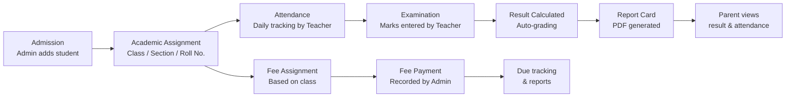

### 9.2 Exam & Result Workflow

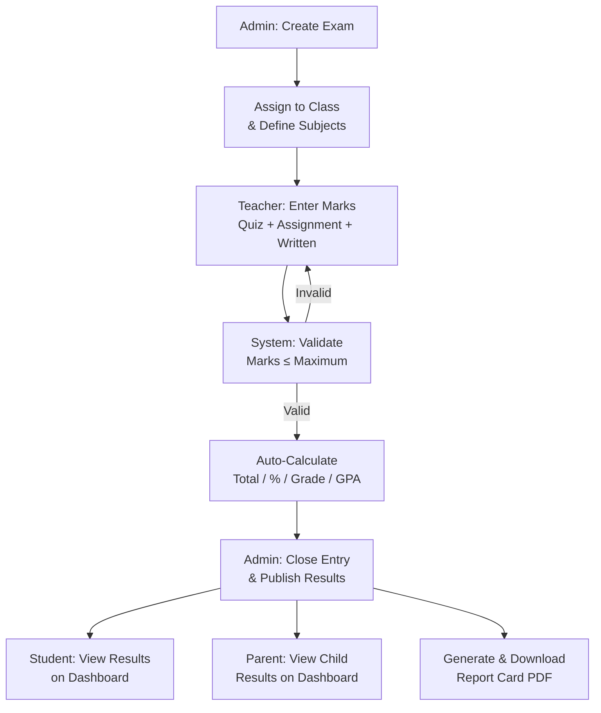

---

## 10. Assumptions & Constraints

### Assumptions

- The school operates on a single academic year calendar (configurable start/end dates).
- Internet connectivity is available at all access points.
- An initial data migration plan will be provided separately for schools with existing records.
- The grading scale is configurable by the Admin during system setup.
- The system supports one school per installation (multi-branch support is out of scope for Phase 1).

### Constraints

- Phase 1 will not include a mobile native app; the web UI must be responsive for tablet use.
- Bulk import of existing student data (CSV upload) is desirable but classified as Phase 2.
- Payment gateway integration (online fee payment) is not in scope for Phase 1.
- The system does not handle biometric attendance integration in Phase 1.

---

## 11. Glossary

| Term               | Definition                                                                       |
|--------------------|----------------------------------------------------------------------------------|
| Admin              | System administrator with full access to all modules                             |
| BRD                | Business Requirements Document                                                   |
| Class Teacher      | Teacher assigned as the primary teacher for a specific class-section             |
| First Login Flag   | A system flag that forces a password change on a user's first login              |
| GPA                | Grade Point Average — a numerical representation of academic performance         |
| Password Reset     | Admin action that sets a temporary password and reactivates the first login flag |
| RBAC               | Role-Based Access Control — restricts system access based on assigned user role  |
| Roll Number        | Unique identifier assigned to a student within a class-section                   |
| Section            | A subdivision of a class (e.g., Grade 10-A, Grade 10-B)                         |
| SMS                | School Management System                                                          |
| Student ID         | Unique system-generated identifier for each student                              |
| TLS/SSL            | Transport Layer Security / Secure Sockets Layer — encryption protocols           |
| Username           | Unique login identifier assigned by Admin; used to access the system             |

---

*End of Business Requirements Document — School Management System v1.1*
